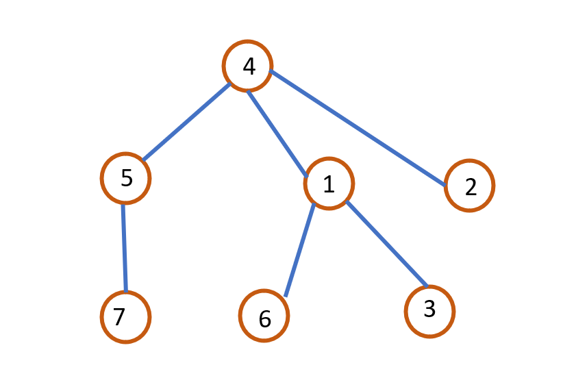
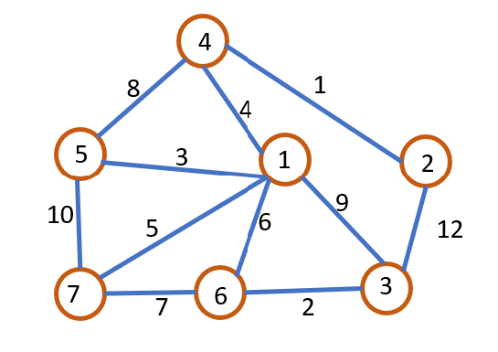

Question 1:

Represent the following as a set.

Question 2:

Represent the before and after of this operation in a single array and the code to make it happen.

Question 3:

Use Kruskal's to find the MST and list the edges.

